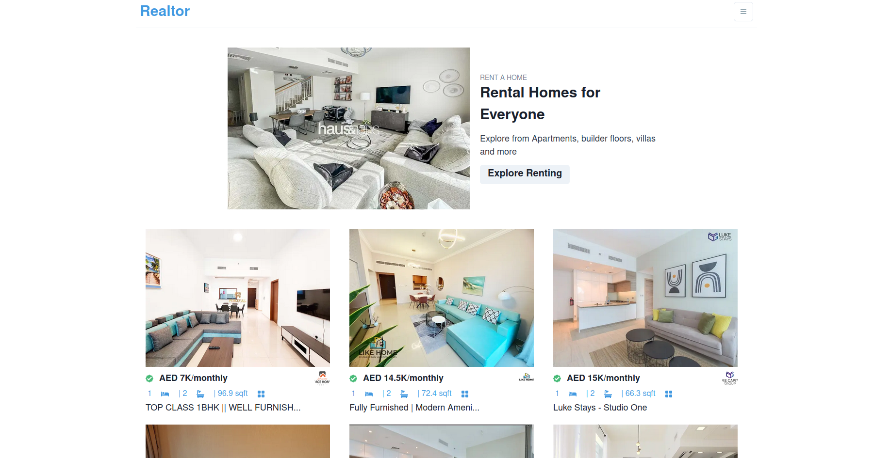

# Realtor-App

This app pulls in API data and allows you to search for different critera and brings up properties. The properties have full stats including pictures with a scrollbar alowing you to scroll through listing photos. 

## Screenshots:

## Built with:

React.JS,
Emotion,
CSS

## How to use:

Download/Extract
cd realtor_app
npm install
npm start

## Contribute:

Feel free to a fork the repo or notify me of any issues that are present

## Credit:

JavaScript Mastery Tutorial - https://www.youtube.com/watch?v=y47gYvXchXM&t=3962s

## License:

MIT © BChainDev
